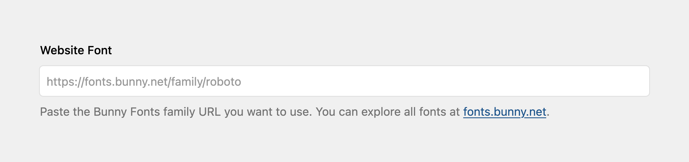

# Font Picker for Kirby

This Kirby plugin adds a welcoming font picker to the Panel so editors can drop in a favorite web font without touching code. It focuses on simplicity, opinionated defaults, and privacy-friendly integrations like Bunny Fonts to keep typography tweaks approachable for anyone working with predefined templates or themes.



## Installation

### Composer

```bash
composer require lemmon/kirby-fontpicker
```

### Git Submodule

```bash
git submodule add https://github.com/lemmon/kirby-plugin-fontpicker.git site/plugins/fontpicker
```

### Manual

[Download the plugin](https://api.github.com/repos/lemmon/kirby-plugin-fontpicker/zipball) and extract it to `/site/plugins/fontpicker`.

## Usage

Add the field to a blueprint and configure defaults as needed:

```yaml
fields:
    website_font:
        label: Website Font
        type: fontpicker
```

Editors can paste a full Bunny Fonts URL (`https://fonts.bunny.net/family/roboto`), type a family name like `Roboto Mono`, or enter a slug such as `roboto-mono`.

Use the stored value to inject fonts and CSS variables in your templates or snippets. A typical pattern is to inject the link tag in a snippet used by `head.php` and share variables via Kirby’s global data or site options.

```php
<?= $page->website_font()
    ->toFont()
    ->withCssVariable('--website-font')
    ->withCssFallbacks('--default-font')
    ->render() ?>
```

Reference the shared variable in your styles (fallback to theme defaults when unset):

```css
html {
    font-family: var(--website-font, var(--default-font));
}
```

### Fine-grained control

Prefer to handle each step yourself? Keep the same structure with the new helpers:

```php
<?php if (($font = $page->website_font()->toFont())->isValid()): ?>
  <link rel="preconnect" href="https://fonts.bunny.net">
  <link rel="stylesheet" href="<?= $font->toStylesheetUrl() ?>">
  <style>
    :root {
      --website-font: "<?= $font->getFamilyName() ?>";
    }
  </style>
<?php endif; ?>
```

`renderStylesheetLink()` and `render()` include the Bunny Fonts `preconnect` tag by default. Pass `false` (for example, `$font->render(preconnect: false)`) when you aggregate multiple selections yourself.

### FontSelection helpers

Calling `$field->toFont()` returns a `Lemmon\Fontpicker\FontSelection` instance with these primary helpers:

-   `isValid()` — whether the selection resolved to a known Bunny Fonts family.
-   `getFamilyName()` / `getSlug()` — surface the resolved family identifier for CSS variables, typography helpers, or debugging.
-   `toStylesheetUrl()` — generate the Bunny Fonts CSS URL, honoring weight and italic filters.
-   `toStylesheetDescriptor()` — fetch the raw slug/tokens array used when combining fonts.
-   `withWeights(...$weights)` — limit requested weights (accepts scalars or arrays).
-   `withItalics(bool $include)` — force italics on/off for this selection.
-   `withCssVariable(string $variable)` — declare the CSS custom property to populate.
-   `withCssFallbacks(...$tokens)` — append fallback tokens (e.g. `--default-font`, `serif`).
-   `renderCssVariables()` — output a `<style>` block with the configured variable and fallbacks.
-   `renderStylesheetLink(bool $preconnect = true)` — output Bunny Fonts `<link>` tags when the selection is valid.
-   `render(bool $preconnect = true)` — combine the link and CSS variable output (skips empty pieces automatically).
-   `getCssVariableDefinition()` — return the variable/value list for aggregation helpers.
-   `getValue()` — access the raw field value exactly as entered by the editor.

### Combining multiple fonts

Aggregate multiple selections into a single Bunny request:

```php
<?= $site->fontCollection(
    $site->theme_default_font()->toFont()
        ->withCssVariable('--font-default')
        ->withCssFallbacks('--font-sans'),
    $site->theme_headings_font()->toFont()
        ->withCssVariable('--font-heading'),
    $site->theme_monospace_font()->toFont()
        ->withCssVariable('--font-mono')
        ->withWeights(400)
        ->withItalics(false),
)->render() ?>
```

`$site->fontCollection()` accepts individual selections or nested arrays, dedupes families, and emits one preconnect tag, one combined stylesheet, and a single `<style>` block. If every font is invalid, the collection still renders fallback-only CSS variables when available.

## Configuration

| Option                                   | Default | Purpose                                                                                                                                                                  |
| ---------------------------------------- | ------- | ------------------------------------------------------------------------------------------------------------------------------------------------------------------------ |
| `lemmon.fontpicker.weights`              | `null`  | Restrict the Bunny weights emitted in the stylesheet URL. Leave `null` to request every available weight; set to values like `[400, 700]` to keep the CSS lean.          |
| `lemmon.fontpicker.cacheTtl`             | `10080` | Cache the Bunny catalog for the given number of minutes (default seven days). Set to `0` to skip caching.                                                                |
| `lemmon.fontpicker.includeItalics`       | `true`  | Control whether italic variants are requested when available. Set to `false` to emit upright styles only (fonts with no upright style still include italics for safety). |
| `lemmon.fontpicker.disableRemoteCatalog` | `false` | Skip fetching `https://fonts.bunny.net/list` and rely solely on the bundled catalog snapshot. Useful for offline or air-gapped environments.                             |

## License

MIT License. See `LICENSE` for details.

---

Questions, issues, or ideas? File them in the repository or reach out; this plugin is designed to be extended.

## Roadmap

-   [x] Let editors enter a simple font name or slug instead of a full URL.
-   [x] Finish the `FontSelection` fluent API, including `withCssVariable()`, `withWeights()`, and `withItalics()` modifiers that no-op safely when a font is invalid.
-   [x] Normalize weight and italics naming across options and field helpers.
-   [x] Retire legacy field shortcuts in favor of `$field->toFont()`.
-   [x] Introduce `$site->fontCollection()` to merge multiple selections into a single Bunny Fonts request (one preconnect, one stylesheet).
-   [x] Ensure the combined renderer skips Bunny links when every selection is invalid while still emitting fallback-only `<style>` tags.
-   [x] Expose collection-level render helpers so templates can output links and CSS variables together without duplication.
-   [ ] Build a Panel preview that renders the selected font inline for quick feedback.
-   [ ] Add a command to refresh the Bunny catalog cache on demand.
-   [ ] Surface validation errors in the Panel when a font selection cannot be resolved, with actionable guidance.
-   [ ] Offer variable-style font choices once Bunny Fonts makes them dependable.
